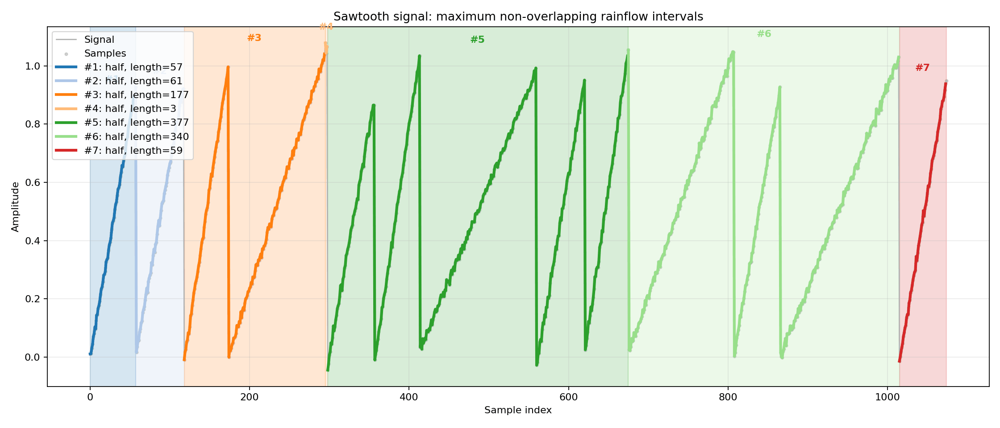
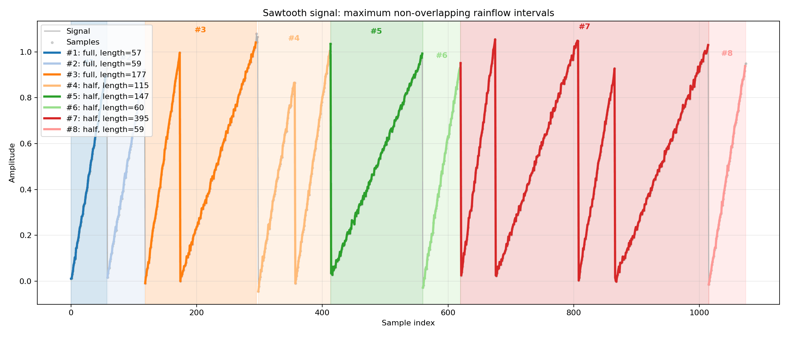
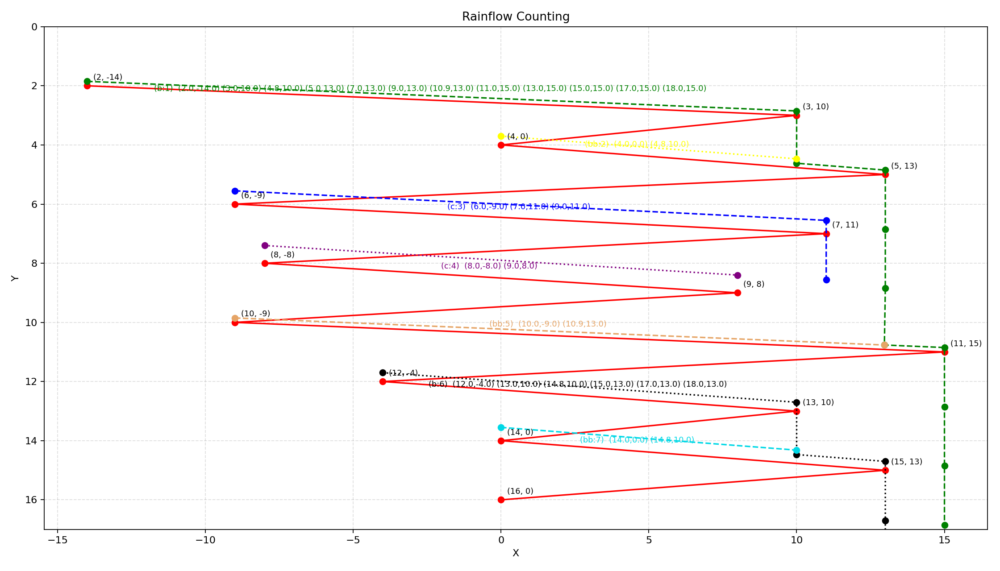

# Rainflow Cycle Analysis and Visualization

[Українська версія](README_UK.md)

Educational Python implementations of rainflow cycle analysis, collected from
the latest versions in the course folder and published with reproducible
results.

## Included implementations

| File | Purpose |
|---|---|
| `src/task_0.py` | Original latest script dated 2026-05-15; compares two counting modes on a deterministic sawtooth signal. |
| `src/rainflow_analysis.py` | Publication-ready version of `task_0.py` with CSV/JSON/PNG export. |
| `src/task_5.py` | Important geometric rainfall-flow implementation using `process_peaks()` and termination cases `b`, `bb`, and `c`; includes a one-line fix for a latent uninitialized-variable path. |
| `tools/run_task_5.py` | Reproducible result exporter for the original `task_5.py`. |

The two `task_0` modes are:

- `rainflow_4point`: stack-based four-point counting;
- `rainflow_3point_demo`: simplified educational three-point comparison.

The three-point mode and `task_5.py` are instructional implementations. They
are not presented as certified ASTM E1049 reference software.

## Main results

| Implementation | Turning points | Counted cycles | Equivalent cycles | Selected intervals |
|---|---:|---:|---:|---:|
| Four-point | 404 | 205 | 199.5 | 7 |
| Three-point demo | 404 | 204 | 201.5 | 8 |

For the same deterministic signal, the simplified mode returns one fewer cycle
but two more equivalent cycles because it classifies several early intervals as
full cycles instead of residual half-cycles.

### Four-point mode



### Three-point educational mode



### `task_5.py` geometric flow visualization



The `task_5.py` sample produces seven flows: two case `b`, three case `bb`, and
two case `c`. Detailed Ukrainian and English explanations are in
[`docs/task_5_algorithm_uk.md`](docs/task_5_algorithm_uk.md) and
[`docs/task_5_algorithm_en.md`](docs/task_5_algorithm_en.md).

## Reproduce the results

```bash
python -m venv .venv
# Windows: .venv\Scripts\activate
# Linux/macOS: source .venv/bin/activate
python -m pip install -r requirements.txt
python tools/run_all.py
python -m unittest discover -s tests -v
```

Individual modes can be run as follows:

```bash
python src/rainflow_analysis.py --method rainflow_4point
python src/rainflow_analysis.py --method rainflow_3point_demo
python tools/run_task_5.py
```

## Validation

- both modes were executed from a clean top-to-bottom command path;
- result JSON, CSV and PNG files were regenerated;
- three deterministic unit tests pass;
- the original `task_0.py` and `task_5.py` are retained for traceability;
- the untouched pre-fix `task_5.py` is retained as `archive/task_5_original.py`;
- no videos, course books, PDFs or unrelated personal files are included.

## License

MIT. See [LICENSE](LICENSE).
